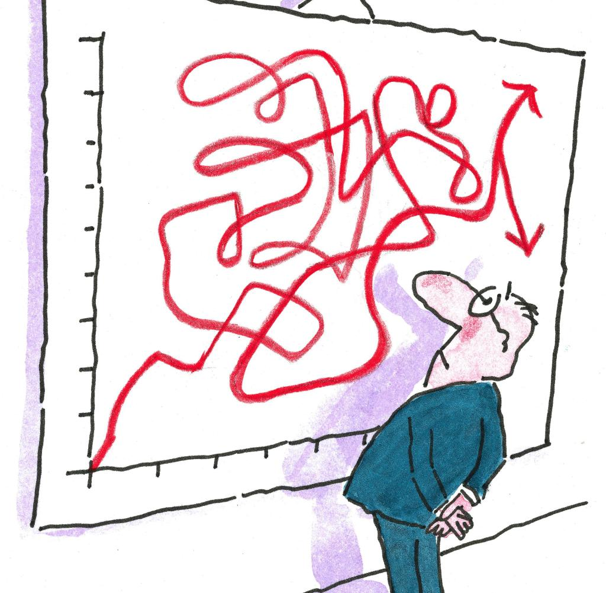
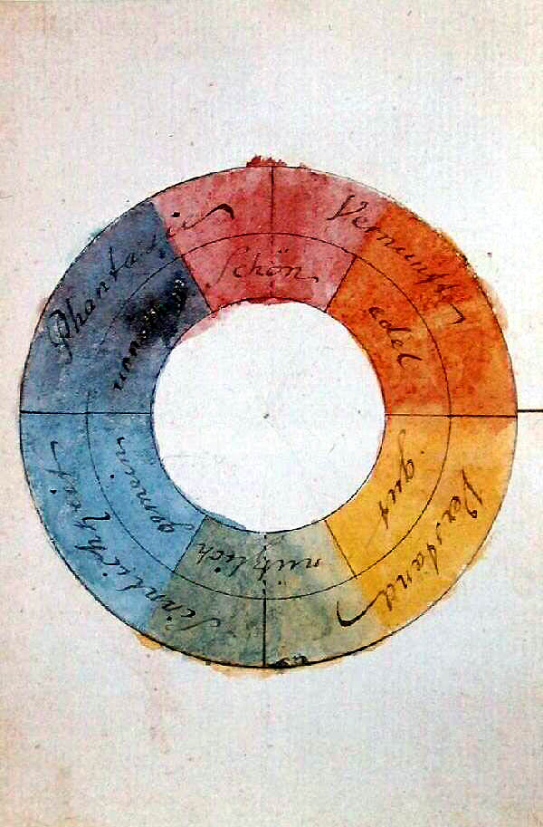
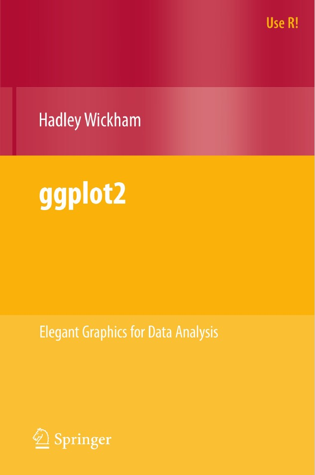
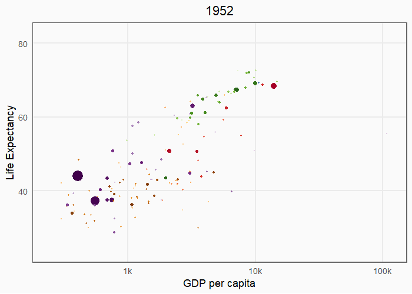
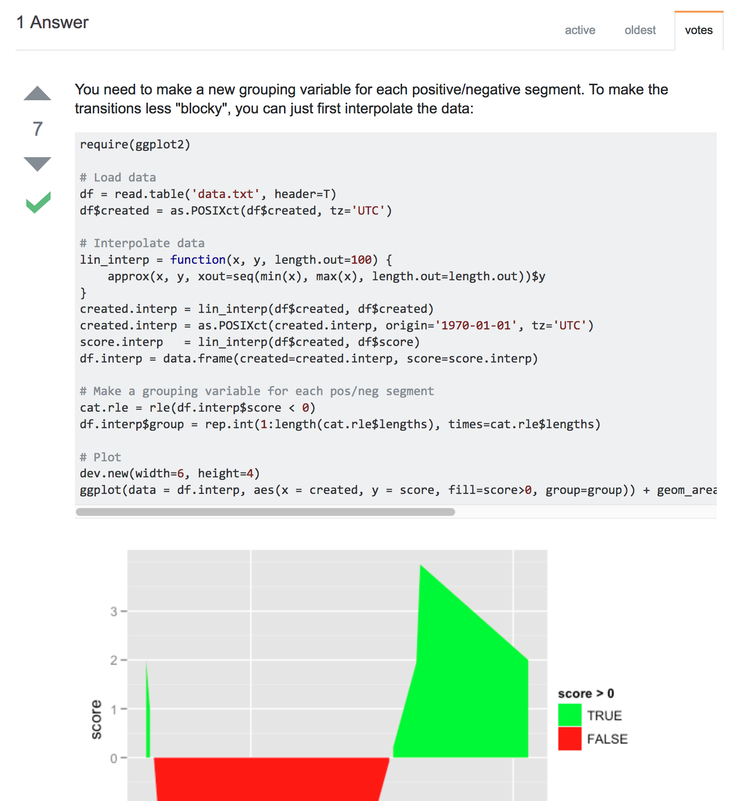
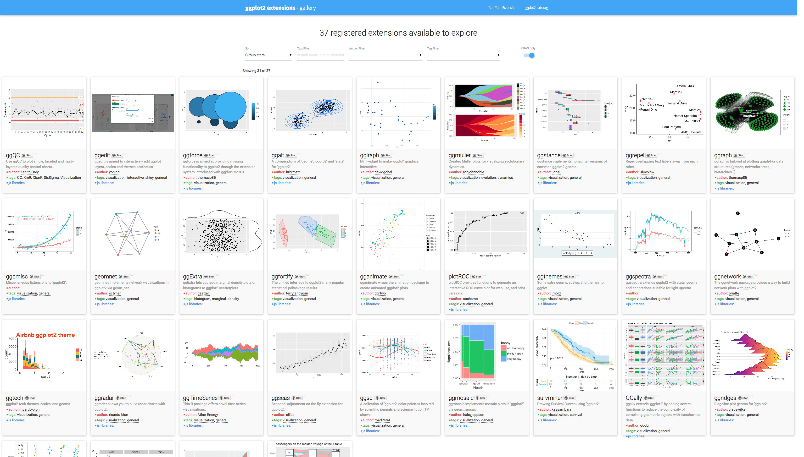

# Ablaufplan
Vorgeschlagener Ablaufplan

| Zeit | Thema |
| --- | --- | --- | --- |
| 9.30h-10.00h | Einführung, Tagesablauf <br> Vorstellung aller TN undErwartungen | 
| 10.00-10.55h | Grundlagen der Grafikgestaltung <br>Einführung in ggplot2 – Logik und Grundlagen | 
| 11.00-12.30h | Praktische Übungen: Grafiken in ggplot2 |
| *12.30-13.30h* | *Mittagspause* |
| 13.30-14.25h | Komplexe Grafiken in ggplot2 – Grundlagen und Beispiele | 
| 14.30-16.00h | Praktische Übungen, komplexe Grundlagen |


---
layout: false
class: inverse center middle text-white

.font200[Grundlagen der Grafikgestaltung
]

---
layout: true
# Grundlagen der Grafikgestaltung

---

## Warum nutzen wir Grafiken?

.left-column[

]

.right-column[
- Veranschaulichung/Darstellung eines Sachverhalts "auf einen Blick".
- Hinweis/Betonung bestimmter Tendenzen (Regressionslinie)
- Zusammenfassung komplexer Informationen
]

--

.right-column[
**Grafiken haben tendenziösen Charakter und sollten daher überlegt gewählt werden.**


Link: [Ein kleines Beispiel zu den Mitgliederzahlen der Piratenpartei](https://flaschenpost.piratenpartei.de/2012/11/05/zahlen-lugen-nicht-diagramme-konnen-tauschen/).
]

---

## Wie erstellen wir Grafiken? 

.left-column[

]

.right-column[
Vier Variablen müssen berücksichtigt werden:

1. Absicht
2. Zielgruppe
3. Leseumstände (Paper? Buch? Präsentation?)
4. Typografie (Schriftführung), Formen und Farbgestaltung

.hl[Während 1-3 i.d.R. gut beantwortbar sind, gibt es zu 4. ein paar (Wissenschaftler*innen oft unbekannte) fachliche Grundlagen.]
]

---
## Farben 

.left-column[
.footnote[Goethes Farbenkreis]
]

.right-column[Farben transportieren Emotionen und wecken Assoziationen. Wichtig für Grafiken sind aber besonders Farbkontraste und die Komplementärfarbe.

- Gegenüberliegende Farben bilden starke Kontraste
- Nebeneinanderliegende Farben eignen sich für Skalen
]

--
.right-column[
### Farben in R 
- Webseite .hl[ColorBrewer]: http://colorbrewer2.org/
- Package .hl[RColorBrewer]

]


---
## Schrift 

Drei unterschiedliche Schrifttypen:
.font80[
<figure>


<figcaption>Antiqua (Serif), Fraktur und Groteskschrift (Sans-Serif).</figcaption>
</figure>]

--

#### Positives Schriftbild

- wenig Schriftarten (zwei, max. drei: Überschriften, Textteile, ggf. Beschriftungen), dies gilt auch für Grafikbeschriftungen!
- Nutzung von *kursiv*, **fett**, und Schriftgröße um das Schriftbild zu strukturieren

---
## Literatur

Gut zugängliche Literatur zum Thema

<div align="center">
 

</div>

---
layout: true 

```{r setup, include=FALSE}
knitr::opts_chunk$set(fig.width=4.25, fig.height=3.5, fig.retina=3,
                      out.width = "100%",
                      message=FALSE, warning=FALSE, cache = TRUE, 
                      autodep = TRUE, hiline=TRUE)

knitr::opts_hooks$set(fig.callout = function(options) {
  if (options$fig.callout) {
    options$echo <- FALSE
    options$out.height <- "99%"
    options$fig.width <- 16
    options$fig.height <- 8
  }
  options
})

options(
  htmltools.dir.version = FALSE, 
  width = 90,
  max.print = 9999,
  knitr.table.format = "html"
)

as_table <- function(...) knitr::kable(..., format='html', digits = 3)
```

---
layout: false
class: inverse center middle text-white

.font200[Warum *ggplot2*?]

Adopted from [A Gentle Guide to the Grammar of Graphics with ggplot2](https://github.com/gadenbuie/gentle-ggplot2) by Garrick Aden-Buie  


---


layout: true
# Warum *ggplot2*?

---
.left-column[


]

.right-column[.font90[
"...because there is a simple set of core principles and very few special cases, ggplot2 is also easy to learn (although it may take a little time to forget your preconceptions from other graphics tools)."]
]
.footnote[Wickham, S.1.]

--
.right-column[

.hl[Idee]: Grafiken werden Stück für Stück zusammengesetzt  
.hl[Ziel]: Maximale Flexibilität.

Zentrale Prinzipien:
1. Datenbasierte Herangehensweise (`tidy data` basiert)
2. Daten werden visuellen Repräsentationen zugeordnet
3. Manuelle Definition von Skalen, Farben, Formen und Gruppen.
]

---

## Installation
 
Installieren des [tidyverse](http://tidyverse.org)

```r
install.packages('tidyverse')
```

Tidyverse laden

```{r library-tidyverse, echo=TRUE, message=TRUE, warning=TRUE}
library(tidyverse)
```

---

## Daten für den heutigen Tag

[mpg](https://ggplot2.tidyverse.org/reference/mpg.html)-Datenset, Teil des R-Basissystems.

[gapminder](http://www.gapminder.org/data/)-Datenset aus dem [`gapminder` package](https://github.com/jennybc/gapminder) von Jenny Bryan.

```{r library-extra, message=FALSE, eval=-1}
install.packages("gapminder")
library(gapminder)
```


---
layout: false
class: inverse center middle text-white

.font200[gg heißt <br>Grammar of Graphics]


```{r guess-data-from-plot-og, echo=FALSE}
df_mpg <- mpg %>% 
  filter(class %in% c("compact", "suv")) %>% 
  filter(manufacturer %in% c("toyota", "ford", "audi")) %>% 
  filter(year == 2008) %>% 
  group_by(manufacturer, model) %>% 
  sample_n(1)

g <- ggplot(df_mpg) +
  aes(x = cty, y = hwy, color = class, shape = manufacturer) +
  geom_point(size = 4) +
  labs(x = NULL, y = NULL, shape = NULL, color = NULL) +
  theme_minimal() +
  theme(
    panel.grid = element_blank(),
    plot.background = element_rect(fill = rgb(250, 250, 250, max = 255),
                                   color = "#777777")
  )
```


---
layout: true
# gg heißt Grammar of Graphics


.left-code[
### Welche Daten liegen hinter dem Plot?
]

---

.right-plot[
```{r guess-data-from-plot-2, echo=FALSE}
g + guides(color = FALSE, shape = FALSE) +
  theme(axis.text = element_blank())
```
]

---

.right-plot[
```{r guess-data-from-plot-3, echo=FALSE}
g + guides(color = FALSE) +
  theme(axis.text = element_blank())
```
]

---

.right-plot[
```{r guess-data-from-plot-1, echo=FALSE}
g + 
  theme(axis.text = element_blank())
```
]

---

.right-plot[
```{r guess-data-from-plot-4, echo=FALSE}
g
```
]

---

.right-plot[
```{r guess-data-from-plot-5, echo=FALSE}
g + theme(panel.grid.major = element_line(color = "grey90"))
```
]

---

.right-plot[
```{r guess-data-from-plot-6, echo=FALSE}
g + 
  ggtitle("MPG Ratings") +
  labs(x = "City", y = "Highway", shape = "Manufacturer", color = "Class") +
  theme(
    panel.border = element_rect(fill = NA, color = "grey85"),
    panel.grid.major = element_line(color = "grey90")
  )
```
]

---
layout:false

.left-code[
### Welche Daten liegen hinter dem Plot?
**Spritverbrauch von Autos**

- Manufacturer
- Car Type (Class)
- City MPG
- Highway MPG
]

.right-plot[
```{r guess-data-from-plot-data, echo=FALSE, results='asis'}
df_mpg %>% 
  select(manufacturer, class, cty, hwy, model) %>% 
  knitr::kable()
```
]

---
layout: false
# Visuelle Elemente einer Grafik

.font120[
- **.hlb[Data]** -- Daten im tidy data-Format
]

--
.font120[
- **.hlb[Geom]etric objects**, die Daten repräsentieren
]

--
.font120[
- **.hlb[Aes]thetic mappings** von den Daten zu visuellen Elementen
]

--
.font120[
- **.hlb[Stat]istics** transformieren Daten vor der Visualisierung
]

--
.font120[
- **.hlb[Coord]inates** legen die Lokalisierung der Objekte fest
]

--
.font120[
- **.hlb[Scale]s** definieren das Verhältnis der Daten zueinander
]

--
.font120[
- **.hlb[Facet]s** gruppieren die Daten in Untergruppen
]


---
layout: true
# gg heißt Grammar of Graphics

.left-column[
### Data

```r
ggplot(data)
```
]

---

.right-column[
#### Tidy Data

1. Jede Variable bildet eine .hl[Spalte]

2. Jede Beobachtung bildet eine .hl[Zeile]

3. Jede Beobachtungseinheit bildet eine .hl[Tabelle]
]

--

.right-column[
#### Vor jeder Grafikerstellung

1. Welche Informationen möchte ich visualisieren?

1. Sind diese Daten in .hl[einer Zeile/Spalte] für jeden Datenpunkt?
]

---
.right-column[
Messy data

```{r tidy-messy1, results='asis', echo=FALSE}
pop_simple <- gapminder %>% 
  filter(
    country %in% c("Canada", "China", "United States"), 
    year >= 1997
  ) %>% 
  select(country, year, pop) %>% 
  mutate(pop = pop / 10^6)

messy_pop <- pop_simple %>% spread(year, pop)

knitr::kable(messy_pop, format = 'html')
```
]

---

.right-column[
Tidy data
```{r tidy-tidy1, result='asis', echo=FALSE}
tidy_pop <- gather(messy_pop, 'year', 'pop', -country)
knitr::kable(head(tidy_pop), format = 'html')
```
]


---
layout: true
# gg heißt Grammar of Graphics

.left-column[
### Data
### Aesthetics

```r
+ aes()
```

]

---

.right-column[
Daten werden visuellen Elementen bzw. Parametern zugeordnet

- year → **x**

- pop → **y**

- country → *shape*, *color*, etc.
]

--

.right-column[

```r
aes(
  x = year,
  y = pop,
  color = country
)
```
]

---
layout: true
# gg heißt Grammar of Graphics

.left-column[
### Data
### Aesthetics
### Geoms

```r
+ geom_*()
```
]

---

.right-column[
Das geometrische Objekt wird festgelegt.

```{r geom_demo, echo=FALSE, fig.width=6, out.width="650px"}
minimal_theme <- theme_bw() +
  theme(
    axis.text = element_blank(),
    axis.ticks = element_blank(),
    panel.grid = element_blank(),
    panel.border = element_blank(),
    axis.title = element_blank(),
    plot.title = element_text(hjust = 0.5),
    text = element_text(family = "Fira Mono"),
    plot.background = element_rect(fill = "#FAFAFA", color = NA),
    panel.background = element_rect(fill = "#FAFAFA", color = NA)
  )

set.seed(4242)
df_geom <- data_frame(y = rnorm(10), x = 1:10)

g_geom <- list()
g_geom$point <- ggplot(df_geom, aes(x, y)) + geom_point() + ggtitle("geom_point()")
g_geom$line <- ggplot(df_geom, aes(x, y)) + geom_line() + ggtitle("geom_line()")
g_geom$bar <- ggplot(df_geom, aes(x, y)) + geom_col() + ggtitle("geom_col()")
g_geom$boxplot <- ggplot(df_geom, aes(y = y)) + geom_boxplot() + ggtitle("geom_boxplot()")
g_geom$histogram <- ggplot(df_geom, aes(y)) + geom_histogram(binwidth = 1) + ggtitle("geom_histogram()")
g_geom$density <- ggplot(df_geom, aes(y)) + geom_density(fill = "grey40", alpha = 0.25) + ggtitle("geom_density()") + xlim(-4, 4)

g_geom <- map(g_geom, ~ . + minimal_theme)

cowplot::plot_grid(plotlist = g_geom)
```
]

---

.right-column[
Einige der [wichtigsten bzw. meistgenutzten geometrischen Objekte](https://eric.netlify.com/2017/08/10/most-popular-ggplot2-geoms/)

.font70.center[
| Type | Function |
|:----:|:--------:|
| Point | `geom_point()` |
| Line | `geom_line()` |
| Bar | `geom_bar()`, `geom_col()` |
| Histogram | `geom_histogram()` |
| Regression | `geom_smooth()` |
| Boxplot | `geom_boxplot()` |
| Text | `geom_text()` |
| Vert./Horiz. Line | `geom_{vh}line()` |
| Count | `geom_count()` |
| Density | `geom_density()` |

<https://eric.netlify.com/2017/08/10/most-popular-ggplot2-geoms/>
]
]


---

.right-column[

Es gibt aber noch mehr: <http://ggplot2.tidyverse.org/reference/>

.font70[
```{r ggplot2-geom-names, echo=FALSE}
# geom_
old_width = options(width = 80)
lsf.str("package:ggplot2") %>% grep("^geom_", ., value = TRUE)
options(width = old_width$width)
```
]
]
--

.right-column[

In RStudio `geom_` eintippen und:
]


---
layout: true
# Eine erste, einfache Grafik

---

.left-code[
```{r first-plot1a, eval=FALSE}
ggplot(tidy_pop)
```
]

.right-plot[
```{r first-plot1a-out, ref.label='first-plot1a', echo=FALSE, out.width="100%"}
```
]

---

.left-code[
```{r first-plot1b, eval=FALSE}
ggplot(tidy_pop) +
  aes(x = year, #<<
      y = pop) #<<
```
]

.right-plot[
```{r first-plot1b-out, ref.label='first-plot1b', echo=FALSE, out.width="100%"}
```
]

---

.left-code[
```{r first-plot1c, eval=FALSE}
ggplot(tidy_pop) +
  aes(x = year,
      y = pop) +
  geom_point() #<<
```
]

.right-plot[
```{r first-plot1c-out, ref.label='first-plot1c', echo=FALSE, out.width="100%"}
```
]

---

.left-code[
```{r first-plot1, eval=FALSE}
ggplot(tidy_pop) +
  aes(x = year,
      y = pop,
      color = country) + #<<
  geom_point()
```
]

.right-plot[
```{r first-plot1-out, ref.label='first-plot1', echo=FALSE, out.width="100%"}
```
]

---

.left-code[
```{r first-plot2-fake, eval=FALSE}
ggplot(tidy_pop) +
  aes(x = year,
      y = pop,
      color = country) +
  geom_point() +
  geom_line() #<<
```

.font80[
```r
geom_path: 
Es gibt nur eine 
Beobachtung pro Gruppe (Land). 
Daher ändern wir die 
aesthetics für die Gruppe.
```
]
]

.right-plot[
```{r first-plot2-fake-out, ref.label='first-plot2-fake', echo=FALSE, out.width="100%"}
```
]

---

.left-code[
```{r first-plot2, eval=FALSE}
ggplot(tidy_pop) +
  aes(x = year,
      y = pop,
      color = country) +
  geom_point() +
  geom_line(
    aes(group = country)) #<<
```
]

.right-plot[
```{r first-plot2-out, ref.label='first-plot2', echo=FALSE, out.width="100%"}
```
]

---


.left-code[
```{r first-plot3, eval=FALSE}
g <- ggplot(tidy_pop) +
  aes(x = year,
      y = pop,
      color = country) +
  geom_point() +
  geom_line(
    aes(group = country))

g
```
]

.right-plot[
```{r first-plot3-out, ref.label='first-plot2', echo=FALSE, out.width="100%"}
```
]

---
layout: true
# gg heißt Grammar of Graphics

.left-column[
### Data
### Aesthetics
### Geoms

```r
+ geom_*()
```
]

---

.right-column[
```r
geom_*(mapping, data, stat, position)
```

- `data` *Geoms* können eigene Daten zugewiesen werden
    - Muss zum globalen Koordinatorensystem passen
- `map` *Geoms* können eigene *aesthetics* haben.
    - Globale *aesthetics* werden sonst übernommen
    - Spezifische *aesthetics* für einzelne *geoms*, z.B.
        - `geom_point` benötigt `x` und `y`, optional `shape`, `color`, `size`, etc.
        - `geom_ribbon`benötigt `x`, `ymin` und `ymax`, optional `fill`
    - `?geom_ribbon`
]

---

.right-column[
```r
geom_*(mapping, data, stat, position)
```

- `stat` Manche *geoms* transformieren die Daten
    - Option: `stat = 'identity'`
    - Ex: `geom_histogram` benötigt `stat_bin()` um Beobachtungen zu gruppieren
    
- `position` Manche ändern die Position im Koordinatensystem
    - `'dodge'`, `'stack'`, `'jitter'`
]

---
layout: true
# gg heißt Grammar of Graphics

.left-column[
### Data
### Aesthetics
### Geoms
### Facet

```r
+facet_wrap() 

+facet_grid()
```
]

---

```{r geom_facet_setup, include=FALSE}
tidy_pop <- left_join(tidy_pop, select(gapminder, country, continent))

g <- ggplot(tidy_pop) +
  aes(x = year,
      y = pop,
      color = country) +
  geom_point() +
  geom_line(aes(group = country))
```

.right-column[
```{r geom_facet, echo=TRUE, out.width="90%", fig.width=6}
g + facet_wrap(~ country)
```
]

---

.right-column[
```{r geom_grid, echo=TRUE, out.width="90%", fig.width=6}
g + facet_grid(continent ~ country)
```
]

---
layout: true
# gg heißt Grammar of Graphics

.left-column[
### Data
### Aesthetics
### Geoms
### Facet
### Labels

```r
+ labs()
```
]

---

.right-column[
```{r labs-ex, echo=TRUE, out.width="90%", fig.width=6}
g + labs(x = "Year", y = "Population")
```
]

---
layout: true
# gg heißt Grammar of Graphics

.left-column[
### Data
### Aesthetics
### Geoms
### Facet
### Labels
### Coords

```r
+ coord_*()
```
]

---

.right-column[
```{r coord-ex, echo=TRUE, out.width="90%", fig.width=6}
g + coord_flip()
```
]

---

.right-column[
```{r coord-ex2, echo=TRUE, out.width="90%", fig.width=6}
g + coord_polar()
```
]

---
layout: true
# gg heißt Grammar of Graphics

.left-column[
### Data
### Aesthetics
### Geoms
### Facet
### Labels
### Coords
### Scales

```r
+ scale_*_*()
```]

---

.right-column[ 
`scale` + `_` + `<aes>` + `_` + `<type>` + `()`

Welche Parameter sollen geändert werden? → `<aes>` <br>
Wie soll der Parameter geändert werden? → `<type>`

Beispiele
- Die diskrete X-Achse soll verändert werden <br> `scale_x_discrete()`
- Die Y-Achse soll logarithmiert werden <br>`scale_y_log10()`
- Die Farbpalette soll geändert werden <br>`scale_fill_discrete()`<br>`scale_color_manual()`
]

---

.right-column[
```{r scale_ex1, out.width="90%", fig.width=6}
g + scale_color_manual(values = c("peru", "pink", "plum"))
```
]

---

.right-column[
```{r scale_ex2, out.width="90%", fig.width=6}
g + scale_y_log10()
```
]

---

.right-column[
```{r scale_ex4, out.width="90%", fig.width=6}
g + scale_x_discrete(labels = c("MCMXCVII", "MMII", "MMVII"))
```
]

---
layout: true
# gg heißt Grammar of Graphics

.left-column[
### Data
### Aesthetics
### Geoms
### Facet
### Labels
### Coords
### Scales
### Theme

```r
+ theme()
```
]

---

.right-column[
Das Aussehen der Grafik ändern<br>>
d.h. Dinge, die keinen Daten zugeordnet sind.

Einige *Themes* sind bereits enthalten

- `g + theme_bw()`
- `g + theme_dark()`
- `g + theme_gray()`
- `g + theme_light()`
- `g + theme_minimal()`]

---

.right-column[
Eine große Anzahl an Parametern kann individuell geändert werden:

- Globale Parameter: `line`, `rect`, `text`, `title`
- `axis`: x-, y-Achsentitel, -ticks, -linien
- `legend`: Legenden
- `panel`: Zeichenfläche
- `plot`: Gesamte Grafik
- `strip`: Facet labels]

---

.right-column[
Die *Themes* haben sog. Hilfsfunktionen:

- `element_blank()` löscht das jeweilige Element
- `element_line()`
- `element_rect()`
- `element_text()`
]

---

.right-column[
```{r, out.width="90%", fig.width=6}
g + theme_bw()
```
]

---

.right-column[
.font80[
```{r, out.width="90%", fig.width=6}
g + theme_minimal() + theme(text = element_text(family = "Palatino"))
```
]
]

---

.right-column[
Das *Theme* kann auch global definiert werden mit `theme_set()`

```{r theme_set}
my_theme <- theme_bw() +
  theme(
    text = element_text(family = "Palatino", size = 12),
    panel.border = element_rect(colour = 'grey80'), 
    panel.grid.minor = element_blank()
  )

theme_set(my_theme)
```

Alle Grafiken im jeweiligen R-File werden mit diesem *Theme* erstellt!
]

---

.right-column[
```{r, out.width="90%", fig.width=6, dependson='theme_set'}
g
```
]

---

.right-column[
```{r, out.width="90%", fig.width=6, dependson='theme_set'}
g + theme(legend.position = 'bottom')
```
]

---
layout: false
# Grafiken speichern

Codebasierte Variante: `ggsave`

```{r ggsave, eval=FALSE}
ggsave(
  filename = "my_plot.png",
  plot = my_plot,
  width = 10,
  height = 8,
  dpi = 100,
  device = "png"
)
```

Oder in RStudio manuell (nicht reproduzierbar!)
---
# Übung: Einfache Grafiken in R

Datei: 

`Companion-script_Uebungen.R`

Übung 0: Reproduktion der ersten Grafik 

Übung 1: Schritt für Schritt-Aufbau einer einfachen Grafik

---

class: inverse, center, middle

# "Live" Coding: <br> Beispiele mit dem *gapminder*-Datensatz

Adopted from [A Gentle Guide to the Grammar of Graphics with ggplot2](https://github.com/gadenbuie/gentle-ggplot2) by Garrick Aden-Buie  

```{r reset_theme, include=FALSE}
theme_set(theme_gray())
```

---
layout: true
# Einfache Grafiken mit *gapminder* Daten

---
```{r head-gapminder, echo=TRUE}
library(gapminder)
head(gapminder)
```

---
```{r summary-gapminder, echo=TRUE, comment=""}
glimpse(gapminder)
```

--

### Erste Grafik: `lifeExp` vs. `gdpPercap`

---
class: fullscreen
layout: true

---

.left-code[
```{r gapminder-le-gdp-1, fig.show="hide"}
ggplot(gapminder) +
  aes(x = gdpPercap,
      y = lifeExp)
```
]

.right-plot[
`)
]

--

Zuerst: Datenpunkte

---

.left-code[
```{r gapminder-le-gdp-2, fig.show="hide"}
ggplot(gapminder) +
  aes(x = gdpPercap,
      y = lifeExp) +
  geom_point() #<<
```
]

.right-plot[
`)
]

--

Next: Kontinente sichtbar machen.

---

.left-code[
```{r gapminder-le-gdp-3, fig.show="hide"}
ggplot(gapminder) +
  aes(x = gdpPercap,
      y = lifeExp,
      color = continent) + #<<
  geom_point()
```
]

.right-plot[
`)
]

--

Schlecht lesbar. Lösung:<br> Logarithmieren der X-Achse

---

.left-code[
```{r gapminder-le-gdp-4, fig.show="hide"}
ggplot(gapminder) +
  aes(x = gdpPercap,
      y = lifeExp,
      color = continent) +
  geom_point() +
  scale_x_log10() #<<
```
]

.right-plot[
`)
]

--

Immer noch sehr unübersichtlich...

---

.left-code[
```{r gapminder-le-gdp-5, fig.show="hide"}
ggplot(gapminder) +
  aes(x = gdpPercap,
      y = lifeExp,
      color = continent) +
  geom_point() +
  scale_x_log10() +
  facet_wrap(~ continent) + #<<
  guides(color = FALSE)     #<<
```

Dank der Facets brauchen wir keine Farblegende mehr.
]

.right-plot[
`)
]

--

Overplotting ... 

---

.left-code[
```{r gapminder-le-gdp-6, fig.show="hide"}
ggplot(gapminder) +
  aes(x = gdpPercap,
      y = lifeExp,
      color = continent) +
  geom_point(size = 0.25) + #<<
  scale_x_log10() +
  facet_wrap(~ continent) +
  guides(color = FALSE)
```
]

.right-plot[
`)
]

--

Gibt es einen Trend?

---

.left-code[
```{r gapminder-le-gdp-7, fig.show="hide"}
ggplot(gapminder) +
  aes(x = gdpPercap,
      y = lifeExp,
      color = continent) +
  geom_line() + #<<
  geom_point(size = 0.25) +
  scale_x_log10() +
  facet_wrap(~ continent) +
  guides(color = FALSE)
```
]

.right-plot[
`)
]

--

`geom_line` verbindet alle Punkte miteinander - nicht was wir wollten!

---

.left-code[
```{r gapminder-le-gdp-8, fig.show="hide"}
ggplot(gapminder) +
  aes(x = gdpPercap,
      y = lifeExp,
      color = continent) +
  geom_line(
    aes(group = country) #<<
  ) +
  geom_point(size = 0.25) +
  scale_x_log10() +
  facet_wrap(~ continent) +
  guides(color = FALSE)
```

]

.right-plot[
`)
]

--

Für einen Trend brauchen wir einen Zeitverlauf. 

---

.left-code[
```{r gapminder-gdp-year-1, fig.show="hide"}
ggplot(gapminder) +
  aes(x = year, #<<
      y = gdpPercap, #<<
      color = continent) +
  geom_line(
    aes(group = country)
  ) +
  geom_point(size = 0.25) +
  scale_y_log10() + #<<
  facet_wrap(~ continent) +
  guides(color = FALSE)
```
]

.right-plot[
`)
]

--

X-Achsenbeschriftung nicht lesbar.

---

.left-code[
```{r gapminder-gdp-year-2, fig.show="hide"}
ggplot(gapminder) +
  aes(x = year,
      y = gdpPercap,
      color = continent) +
  geom_line(
    aes(group = country)
  ) +
  geom_point(size = 0.25) +
  scale_y_log10() +
  scale_x_continuous(breaks = #<<
    seq(1950, 2000, 25) #<<
  ) +                            #<<
  facet_wrap(~ continent) +
  guides(color = FALSE)
```
]

.right-plot[
`)
]

--

Schauen wir uns die Lebenserwartung an.

---

.left-code[
```{r gapminder-le-year-1, fig.show="hide"}
ggplot(gapminder) +
  aes(x = year, 
      y = lifeExp, #<<
      color = continent) +
  geom_line(
    aes(group = country)
  ) +
  geom_point(size = 0.25) +
  #scale_y_log10() + #<<
  scale_x_continuous(breaks = 
    seq(1950, 2000, 25)
  ) +  
  facet_wrap(~ continent) +
  guides(color = FALSE)
```
]

.right-plot[
`)
]

--

Die Trendlinie.

---

.left-code[
```{r gapminder-le-year-2, fig.show="hide"}
ggplot(gapminder) +
  aes(x = year, 
      y = lifeExp,
      color = continent) +
  geom_line(
    aes(group = country)
  ) +
  geom_point(size = 0.25) +
  geom_smooth() + #<<
  scale_x_continuous(breaks = 
    seq(1950, 2000, 25)
  ) +  
  facet_wrap(~ continent) +
  guides(color = FALSE)
```
]

.right-plot[
`)
]

--

Die Trendlinie ist kaum sichtbar. 

---

.left-code[
```{r gapminder-le-year-3, fig.show="hide"}
ggplot(gapminder) +
  aes(x = year, 
      y = lifeExp,
      color = continent) +
  geom_line(
    aes(group = country),
    color = "grey75" #<<
  ) +
  geom_point(size = 0.25) +
  geom_smooth() + 
  scale_x_continuous(breaks = 
    seq(1950, 2000, 25)
  ) +  
  facet_wrap(~ continent) +
  guides(color = FALSE)
```
]

.right-plot[
`)
]

--

Die Punkte stören noch.

---

.left-code[
```{r gapminder-le-year-4, fig.show="hide"}
ggplot(gapminder) +
  aes(x = year, 
      y = lifeExp,
      color = continent) +
  geom_line(
    aes(group = country),
    color = "grey75"
  ) +
  #geom_point(size = 0.25) + #<<
  geom_smooth() + 
  scale_x_continuous(breaks = 
    seq(1950, 2000, 25)
  ) +  
  facet_wrap(~ continent) +
  guides(color = FALSE)
```
]

.right-plot[
`)
]

--

Vergleich der Kontinente in einem Plot.

---

.left-code[
```{r gapminder-le-year-5, fig.show="hide"}
ggplot(gapminder) +
  aes(x = year, 
      y = lifeExp,
      color = continent) +
  geom_line(
    aes(group = country),
    color = "grey75"
  ) +
  geom_smooth() + 
  # scale_x_continuous(
  #   breaks = 
  #     seq(1950, 2000, 25)
  # ) +  
  # facet_wrap(~ continent) + #<<
  guides(color = FALSE)
```
]

.right-plot[
`)
]

--

Jetzt brauchen wir wieder eine Legende.

---

.left-code[
```{r gapminder-le-year-6, fig.show="hide"}
ggplot(gapminder) +
  aes(x = year, 
      y = lifeExp,
      color = continent) +
  geom_line(
    aes(group = country),
    color = "grey75"
  ) +
  geom_smooth() + 
  theme( #<<
  legend.position = "bottom" #<<
  ) #<<
```
]

.right-plot[
`)
]

--

Optische Korrekturen mit dem *minimal theme*.

---

.left-code[
```{r gapminder-le-year-7, fig.show="hide"}
ggplot(gapminder) +
  aes(x = year, 
      y = lifeExp,
      color = continent) +
  geom_line(
    aes(group = country),
    color = "grey75"
  ) +
  geom_smooth() + 
  theme_minimal() + #<<
  theme(
  legend.position = "bottom"
  )
```
]

.right-plot[
`)
]

--

Schriftgröße ändern.

---

.left-code[
```{r gapminder-le-year-8, fig.show="hide"}
ggplot(gapminder) +
  aes(x = year, 
      y = lifeExp,
      color = continent) +
  geom_line(
    aes(group = country),
    color = "grey75"
  ) +
  geom_smooth() + 
  theme_minimal( 
    base_size = 8) + #<<
  theme(
  legend.position = "bottom"
  )
```
]

.right-plot[
`)
]

---


.left-code[

### Ein Blick auf einzelne Länder 

```{r gapminder-1stworld-data, fig.show="hide"}
firstworld <- 
  gapminder %>% 
  filter(
    country %in% c(
      "United States",
      "Canada",
      "Germany",
      "France"
    )
  )
```

]

.right-plot[
```{r echo=FALSE}
firstworld
```
]

---

.left-code[
```{r gapminder-1stworld-1, fig.show="hide"}
ggplot(firstworld) +
  aes(
    x = year,
    y = pop
  ) +
  geom_col()
```
]

.right-plot[
`)
]

--

Wie teilt sich die Bevölkerung auf die Länder auf?

---

.left-code[
```{r gapminder-1stworld-2, fig.show="hide"}
ggplot(firstworld) +
  aes(
    x = year,
    y = pop,
    fill = country #<<
  ) +
  geom_col()
```
]

.right-plot[
`)
]

--

Einfaches statt gestapeltes Balkendiagramm.

---

.left-code[
```{r gapminder-1stworld-3, fig.show="hide"}
ggplot(firstworld) +
  aes(
    x = year,
    y = pop,
    fill = country
  ) +
  geom_col(
    position = "dodge" #<<
  )
```

`position = "dodge"` platziert die Balken nebeneinander.
]

.right-plot[
`)
]

--

Zahlen auf der Y-Achse transformieren?

---

.left-code[
```{r gapminder-1stworld-4, fig.show="hide"}
ggplot(firstworld) +
  aes(
    x = year,
    y = pop / 10^6, #<<
    fill = country
  ) +
  geom_col(
    position = "dodge" 
  )
```

*aesthetics* können rechnen!
]

.right-plot[
`)
]

--

Die Länder im Einzelnen.

---

.left-code[
```{r gapminder-1stworld-5, fig.show="hide"}
ggplot(firstworld) +
  aes(
    x = year,
    y = pop / 10^6,
    fill = country
  ) +
  geom_col(
    position = "dodge" 
  ) +
  facet_wrap(~ country) + #<<
  guides(fill = FALSE) #<<
```
]

.right-plot[
`)
]

--

Die Y-Achse kann individuell angepasst werden. (.hl[Achtung!])

---

.left-code[
```{r gapminder-1stworld-6, fig.show="hide"}
ggplot(firstworld) +
  aes(
    x = year,
    y = pop / 10^6,
    fill = country
  ) +
  geom_col(
    position = "dodge" 
  ) +
  facet_wrap(~ country,
    scales = "free_y") + #<<
  guides(fill = FALSE)
```
]

.right-plot[
`)
]

--

Schauen wir uns die Lebenserwartung an.

---

.left-code[
```{r gapminder-1stworld-7, fig.show="hide"}
ggplot(firstworld) +
  aes(
    x = year,
    y = lifeExp, #<<
    fill = country
  ) +
  geom_col(
    position = "dodge" 
  ) +
  facet_wrap(~ country,
    scales = "free_y") +
  guides(fill = FALSE)
```
]

.right-plot[
`)
]

--

Hier wäre &#x1F4C8; passender als &#x1F4CA;.

---

.left-code[
```{r gapminder-1stworld-8, fig.show="hide"}
ggplot(firstworld) +
  aes(
    x = year,
    y = lifeExp,
    fill = country
  ) +
  geom_line() + #<<
  facet_wrap(~ country,
    scales = "free_y") +
  guides(fill = FALSE)
```
]

.right-plot[
`)
]

--

&#x1F4CA; brauchen **fill**, &#x1F4C8; brauchen **color**!

---

.left-code[
```{r gapminder-1stworld-9, fig.show="hide"}
ggplot(firstworld) +
  aes(
    x = year,
    y = lifeExp,
    color = country #<<
  ) +
  geom_line() +
  facet_wrap(~ country,
    scales = "free_y") +
  guides(color = FALSE) #<<
```
]

.right-plot[
`)
]

--

Dies ist in einer Grafik übersichtlicher!

---

.left-code[
```{r gapminder-1stworld-10, fig.show="hide"}
ggplot(firstworld) +
  aes(
    x = year,
    y = lifeExp,
    color = country
  ) +
  geom_line()
```
]

.right-plot[
`)
]

---

### Wie sieht es mit der Lebenserwartung aus?

- auf einem Kontinent
- global

---

.left-code[
```{r gapminder-all-americas-1, fig.show="hide"}
gapminder %>% 
  filter(
    continent == "Americas"
  ) %>% #<<
  ggplot() + #<<
  aes(
    x = year,
    y = lifeExp
  )
```

pipe funktioniert mit `ggplot()`!  
.hl[Achtung]: `%>%` vs. `+`
]

.right-plot[
`)
]

--

Boxplot mit dem Range der Lebenserwartung.

---

.left-code[
```{r gapminder-all-americas-2, fig.show="hide"}
gapminder %>% 
  filter(
    continent == "Americas"
  ) %>%
  ggplot() +
  aes(
    x = year,
    y = lifeExp
  ) +
  geom_boxplot() #<<
```
]

.right-plot[
`)
]

--

Ein Boxplot pro Jahr.

---

.left-code[
```{r gapminder-all-americas-3, fig.show="hide"}
gapminder %>% 
  filter(
    continent == "Americas"
  ) %>%
  mutate( #<<
    year = factor(year) #<<
  ) %>%  #<<
  ggplot() +
  aes(
    x = year,
    y = lifeExp
  ) +
  geom_boxplot()
```
]

.right-plot[
`)
]

--

Globale Lebenserwartung: Auskommentieren des Filters.

---

.left-code[
```{r gapminder-all-americas-4, fig.show="hide"}
gapminder %>% 
  # filter(
  #   continent == "Americas"
  # ) %>%
  mutate(
    year = factor(year)
  ) %>% 
  ggplot() +
  aes(
    x = year,
    y = lifeExp
  ) +
  geom_boxplot()
```
]

.right-plot[
`)
]

--

Einen Boxplot pro Kontinent?

---

.left-code[
```{r gapminder-all-americas-5, fig.show="hide"}
gapminder %>% 
  mutate(
    year = factor(year)
  ) %>% 
  ggplot() +
  aes(
    x = year,
    y = lifeExp,
    fill = continent #<<
  ) +
  geom_boxplot()
```
]

.right-plot[
`)
]

--

Die Jahre sind kaum zu lesen, also: &#x1F504;

---

.left-code[
```{r gapminder-all-americas-6, fig.show="hide"}
gapminder %>% 
  mutate(
    year = factor(year)
  ) %>% 
  ggplot() +
  aes(
    x = year,
    y = lifeExp,
    fill = continent
  ) +
  geom_boxplot() +
  coord_flip() #<<
```
]

.right-plot[
`)
]

--

`dplyr` funktiniert auch im *ggplot2*-Code (Lebenserwartung pro Dekade)

---

.left-code[
```{r gapminder-all-americas-7, fig.show="hide"}
gapminder %>% 
  mutate(
    decade = floor(year / 10), #<<
    decade = decade * 10,      #<<
    decade = factor(decade)      #<<
  ) %>% 
  ggplot() +
  aes(
    x = decade, #<<
    y = lifeExp,
    fill = continent
  ) +
  geom_boxplot() +
  coord_flip()
```
]

.right-plot[
`)
]

--

Ohne Ozeanien: `filter`-Befehl.

---

.left-code[
```{r gapminder-all-americas-8, fig.show="hide", echo=1}
g <- gapminder %>% 
  filter( #<<
    continent != "Oceania" #<<
  ) %>% #<<
  mutate(
    decade = floor(year / 10) * 10, decade = factor(decade)      
  ) %>% 
  ggplot() +
  aes(
    x = decade,
    y = lifeExp,
    fill = continent
  ) +
  geom_boxplot() +
  coord_flip()

g
```
]

.right-plot[
`)
]

---

.left-code[
```{r gapminder-all-americas-9, fig.show="hide", echo=1}
g +
  theme_minimal(8) +
  labs(
    y = "Life Expectancy",
    x = "Decade",
    fill = NULL,
    title = "Life Expectancy by Continent and Decade",
    caption = "gapminder.org"
  )
```

.hl[Achtung]: `x` und `y` bleiben auch bei `coord_flip()` erhalten.  

`fill = NULL` entfernt den Titel der Label.
]

.right-plot[
`)
]

---
layout: false
class: inverse, center, middle

# Komplexe Grafiken

Adopted from [A Gentle Guide to the Grammar of Graphics with ggplot2](https://github.com/gadenbuie/gentle-ggplot2) by Garrick Aden-Buie

who was inspired by the [TED-Talk "The Best Stats You've Ever Seen"](http://www.ted.com/talks/hans_rosling_shows_the_best_stats_you_ve_ever_seen) by Hans Rosling


---
# Grundlayout

```{r hans-rosling-1, echo=1, out.height="99%", fig.width=16, fig.height=8, fig.show="hide"}
g_hr <- 
  ggplot(gapminder) +
  aes(x = gdpPercap, y = lifeExp, size = pop, color = country) +
  geom_point() +
  facet_wrap(~year)
g_hr
```

.plot-callout[
`)
]

---
# Entfernen der Legende

```{r hans-rosling-1a, echo=1, out.height="99%", fig.width=16, fig.height=8, fig.show="hide"}
g_hr <- 
  ggplot(gapminder) +
  aes(x = gdpPercap, y = lifeExp, size = pop, color = country) +
  geom_point() +
  facet_wrap(~year) +
  guides(color = FALSE, size = FALSE)
g_hr
```

.plot-callout[
`)
]

---
# X-Achse, Farbe und Größe der Punkte anpassen

```{r hans-rosling-2, echo=1, out.height="99%", fig.width=16, fig.height=8, fig.show="hide"}
g_hr <- 
  g_hr +
  scale_x_log10(breaks = c(10^3, 10^4, 10^5), labels = c("1k", "10k", "100k")) +
  scale_color_manual(values = gapminder::country_colors) +
  scale_size(range = c(0.5, 12))
  
g_hr
```

.plot-callout[
`)
]

---
# Optimieren der Beschriftung

<br><br>

```{r hans-rosling-3, echo=1, out.height="99%", fig.width=16, fig.height=8, fig.show="hide"}
g_hr <- 
  g_hr +
  labs(
    x = "GDP per capita",
    y = "Life Expectancy"
  ) +
  theme_minimal(base_family = "Fira Sans") +
  theme(
    strip.text = element_text(size = 16, face = "bold"),
    panel.border = element_rect(fill = NA, color = "grey40"),
    panel.grid.minor = element_blank()
  )
g_hr
```

.plot-callout.top-right[
`)
]

---
# Der gesamte Code und die Grafik

.font70[
```{r hans-rosling-final, fig.width=16, fig.height=9, fig.show="hide"}
ggplot(gapminder) +
  aes(x = gdpPercap, y = lifeExp, size = pop, color = country) +
  geom_point() +
  facet_wrap(~year) +
  guides(color = FALSE, size = FALSE) +
  scale_x_log10(
    breaks = c(10^3, 10^4, 10^5), 
    labels = c("1k", "10k", "100k")) +
  scale_color_manual(values = gapminder::country_colors) +
  scale_size(range = c(0.5, 12)) +
  labs(
    x = "GDP per capita",
    y = "Life Expectancy") +
  theme_minimal(14, base_family = "Fira Sans") +
  theme(
    strip.text = element_text(size = 16, face = "bold"),
    panel.border = element_rect(fill = NA, color = "grey40"),
    panel.grid.minor = element_blank())
```
]

---
class: fullscreen
background-image: url(`r knitr::fig_chunk("hans-rosling-final", "png")`)
background-size: cover

---
# Bonus: Animierte Grafiken!

.left-code[
```{r include=FALSE}
library(gganimate)
g_hra <- 
  ggplot(gapminder) +
  aes(x = gdpPercap, y = lifeExp, size = pop, color = country) +
  geom_point() +
  guides(color = FALSE, size = FALSE) +
  scale_x_log10(
    breaks = c(10^3, 10^4, 10^5), 
    labels = c("1k", "10k", "100k")) +
  scale_color_manual(values = gapminder::country_colors) +
  scale_size(range = c(0.5, 12)) +
  labs(
    x = "GDP per capita",
    y = "Life Expectancy") +
  theme_minimal(18, base_family = "Fira Sans") +
  theme(
    plot.background = element_rect("#FAFAFA", color = NA),
    strip.text = element_text(size = 16, face = "bold"),
    panel.border = element_rect(fill = NA, color = "grey40"),
    panel.grid.minor = element_blank(),
    plot.title = element_text(hjust = 0.5)
  ) + 
  transition_states(
    year, 1, 0
  ) + 
  ggtitle("{closest_state}")

anim_save("images/hans-rosling-esque.gif", 
          animate(g_hra, width = 700, height = 500))
```

.font70[
```{r hans-rosling-animated, eval=FALSE}
# library(devtools)
# install_github("thomasp85/gganimate")
library(gganimate)

# Same plot without facet_wrap()
g_hra + 
  transition_states(year, 1, 0) + 
  ggtitle("{closest_state}")
```
]
]

--

.right-plot[

]

---
# Übung: Komplexe Grafiken in R

Datei: `Companion-script_Uebungen.R`

Übung 2: Grafiken mit gapminder Daten aufbauen 

Übung 3: Americas Grafik mit Gapminder Daten

Übung 4: Alle amerikanischen Länder

Übung 5: Hans Rosling Grafik

---
layout: false
class: inverse, middle, center

# Zum Abschluss ... 

---
# Stack Exchange ist _die_ Adresse


---



---
layout: false

# ggplot2 Extensions: [ggplot2-exts.org](https://www.ggplot2-exts.org/gallery/)



---
# ggplot2-Tools

### Nützliche Links

- **ggplot2 Dokumentation:** <http://ggplot2.tidyverse.org/>

- **R4DS - Datenvisualisierung (E-Book online):** <http://r4ds.had.co.nz/data-visualisation.html>

- **Hadley Wickhams ggplot2 Buch:** <https://www.springer.com/gp/book/9780387981413>

### Nützliche RStudio Add-Ins (nicht getestet)

- [esquisse](https://github.com/dreamRs/esquisse): Interaktive ggplot2-Plots erstellen

- [ggplotThemeAssist](https://github.com/calligross/ggthemeassist): ggplot-Themes interaktiv bearbeiten

- [ggedit](https://github.com/metrumresearchgroup/ggedit): Layer, Achsen und Themes bearbeiten

---
# Übungen

### #TidyTuesday

- <https://github.com/rfordatascience/tidytuesday>

### Datensets für Übungen

- `fivethirtyeight`

- `nycflights`

- `ggplot2movies`

---
class: inverse, center, middle

# Danke schön!

.font150.text-white[
Regina Weber <br>
[www.reginaweber.de](https://www.reginaweber.de) <br>
regina.weber@hochschule-rhein-waal.de
]
